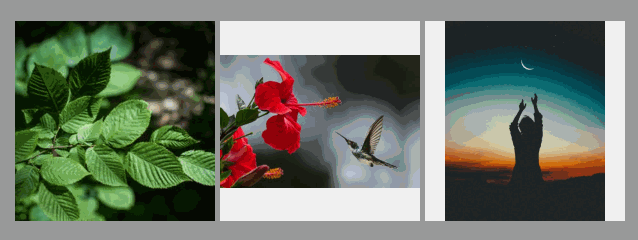

# React-Image

basic image preview component with headers


[](https://github.com/Rynxiao/react-image/blob/master/LICENSE)
[](https://travis-ci.org/Rynxiao/react-image)
[](https://www.npmjs.com/package/rt-image)

## Usage

```shell script
npm install rt-image

# yarn add rt-image
```

### examples

```typescript jsx
import React, { useEffect, useState } from 'react';
import ReactDOM from 'react-dom';

import Image from 'rt-image';

const images = [
  'https://image.shutterstock.com/image-photo/white-transparent-leaf-on-mirror-260nw-1029171697.jpg',
  'https://images.pexels.com/users/avatars/454176/naturally-beautiful-inspiration-893.jpeg?w=256&h=256&fit=crop&crop=faces&auto=compress',
  'https://images.pexels.com/photos/1133957/pexels-photo-1133957.jpeg?auto=compress&cs=tinysrgb&dpr=1&w=500',
  'https://images.pexels.com/photos/556666/pexels-photo-556666.jpeg?auto=compress&cs=tinysrgb&dpr=1&w=500',
];

const App = () => {
  const [src, setSrc] = useState(images[0]);
  useEffect(() => { setTimeout(() => setSrc(images[1])); }, [src]);

  return (
    <div className="App">
      <Image style={{ marginRight: '5px' }} src={src} errorMessage="some thing bad happen" />
      <Image style={{ marginRight: '5px' }} src={images[2]} errorMessage="load image error" />
      <Image src={images[3]} />
      <Image src={images[3]} headers={{ Authorization: 'xxx' }} />
    </div>
  );
};

ReactDOM.render(<App />, document.getElementById('root'));
```



### Properties

- **src**: image url
- **width**: image component width
- **height**: image component height, default same with width
- **className**: custom className to image component
- **style**: styles
- **description**: used as image `alt` currently
- **errorMessage**: custom error message
- **headers**: request image width headers

## License

MIT © [Rynxiao/react-image](https://github.com/Rynxiao/react-image)


